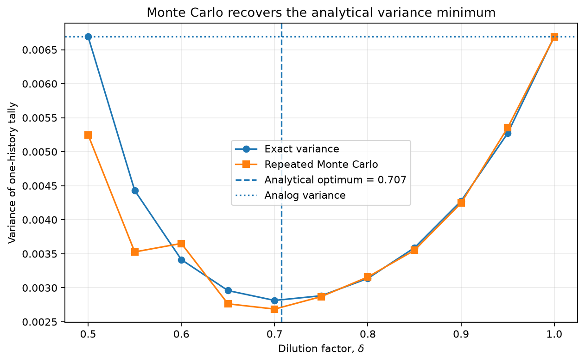
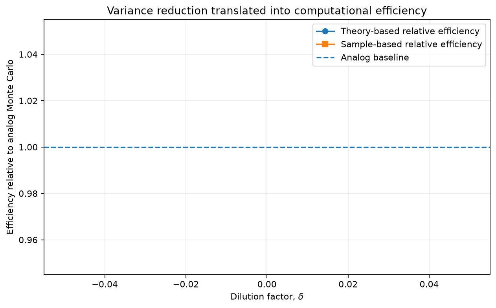

# Monte Carlo Radiation Transport

[](https://github.com/RansiJ/monte-carlo-shielding/actions/workflows/ci.yml)

A compact radiation-transport project that uses a deliberately solvable 1D model to test **Monte Carlo variance reduction against exact theory**.

The transport model assumes a homogeneous slab with forward delta scattering. That simplification is useful here: it gives a closed-form transmission probability and an exact second moment for the biased estimator, so the simulation can be validated rather than treated as a black box.

## Key result

For the dilution convention

\[
\tilde{\sigma}_j = \delta\sigma_j,
\qquad 0 < \delta \le 1,
\]

the one-history tally variance is

\[
\operatorname{Var}(Q)=
\exp\left\{L\left[(\delta-2)\sigma_t+\frac{\sigma_s}{\delta}\right]\right\}-T^2,
\]

which gives

\[
\delta_{\mathrm{opt}}=\sqrt{\frac{\sigma_s}{\sigma_t}}.
\]

With the parameters used in the notebook, the continuous optimum is approximately `0.7071`. The repeated Monte Carlo experiment identifies `delta = 0.70` as the minimum-variance grid point, and the exact optimum reduces the one-history tally variance by about `2.38x` relative to analog Monte Carlo.



The committed benchmark also shows an efficiency improvement in the same region once measured CPU cost is included. The exact numerical efficiency is implementation- and machine-dependent, so it is treated as a computational benchmark rather than a physical constant.



## What the project demonstrates

- Analog event-by-event Monte Carlo transport.
- Dilution biasing with likelihood-ratio correction.
- Analytical derivation of the estimator's second moment and variance.
- An analytical variance-minimizing biasing parameter.
- Repeated independent runs to compare exact and empirical variance.
- CPU-based efficiency measurements using repeated timings.
- Vectorized advancement of active particle histories for practical runtime.
- Automated tests for cross-section consistency, free-path sampling, convergence, the exact variance, and the `delta = 1` analog identity.

## Physical model

For slab thickness `L`,

\[
\sigma_t=\sigma_s+\sigma_a.
\]

Because scattering does not change direction, transmission is controlled only by absorption:

\[
T=\exp(-\sigma_aL).
\]

This exact transmission is the reference against which both estimators are checked.

## Repository structure

```text
monte-carlo-shielding/
├── README.md
├── requirements.txt
├── pytest.ini
├── figures/
│   ├── theoretical_variance.png
│   ├── variance_validation.png
│   ├── unbiasedness_check.png
│   └── relative_efficiency.png
├── notebooks/
│   └── shielding_mc.ipynb
├── src/
│   ├── __init__.py
│   └── shielding_mc.py
├── tests/
│   └── test_shielding_mc.py
└── report/
    ├── monte_carlo_radiation_transport_report.pdf
    ├── monte_carlo_radiation_transport_report.tex
    ├── generate_report_figures.py
    ├── figures/
    └── benchmark_summary.csv
```

The notebook contains the derivation, benchmark, figures, and interpretation. Reusable transport and analytical functions live in `src/shielding_mc.py`; consistency checks are kept in `tests/` so basic diagnostics do not interrupt the main notebook narrative. The technical report under `report/` presents the complete methodology and results.

## Run locally

```bash
python -m venv .venv
source .venv/bin/activate  # Windows: .venv\Scripts\activate
pip install -r requirements.txt
pytest -q
jupyter notebook notebooks/shielding_mc.ipynb
```

The committed notebook is executed from a clean kernel. The transport routines advance all currently active histories in vectorized batches, which keeps the event-by-event logic while making the repeated experiment fast enough to reproduce interactively.

## Interpretation

The variance-minimizing `delta` is known analytically for this simplified problem. The Monte Carlo sweep therefore serves as a validation experiment, not as the primary optimizer. Very aggressive dilution can create rare high-weight histories and unstable empirical second moments; the benchmark focuses on the neighborhood of the analytical optimum where repeated finite-sample comparisons are informative.

## Scope

This is a controlled 1D transport study, not a general-purpose shielding solver. It does not include angular scattering, backscattering, energy loss, energy-dependent cross sections, layered materials, or multidimensional geometry.

The PDF under `report/` follows the same convention and derivation as the notebook and source code.

## License

This project is released under the [MIT License](LICENSE).
